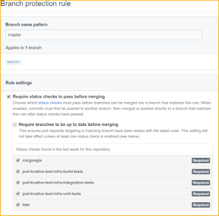

# Prow setup

## Creating the cluster

1. Create the GKE cluster, the role bindings and the GitHub secrets. You might
   need to update [Makefile](./prow/Makefile). For details, see
   <https://github.com/kubernetes/test-infra/blob/master/prow/getting_started_deploy.md>.

1. Ensure the GCP projects listed in
   [resources.yaml](./prow/boskos/resources.yaml) are created.

1. Apply [config_start.yaml](./prow/config_start.yaml) to the cluster.

1. Apply Boskos [config_start.yaml](./prow/boskos/config_start.yaml) to the
   cluster.

1. Run `make update-cluster`, `make update-boskos`, `make update-config`,
   `make update-plugins` and `make update-boskos-config`.

1. If SSL needs to be reconfigured, promote your ingress IP to static in Cloud
   Console, and
   [create the TLS secret](https://kubernetes.io/docs/concepts/services-networking/ingress/#tls).

## Expanding Boskos pool

1. Create a new GCP project and add it to
   [resources.yaml](./prow/boskos/resources.yaml). Please follow the current
   naming scheme.

1. Run `./ci/prow/boskos/permissions.sh <project_name>` to setup the IAM
   permissions and APIs needed.

1. Run `make update-boskos-config` to update the Boskos config.

## Setting up Prow for a new organization

1. In GitHub, add the following
   [webhooks](https://developer.github.com/webhooks/) to the org (or repo), in
   `application/json` format and for all events. Ask one of the owners of
   knative/test-infra for the webhook secrets.

   1. <http://prow.knative.dev/hook> (for Prow)
   1. <https://github-dot-knative-tests.appspot.com/webhook> (for Gubernator PR
      Dashboard)

1. Create a team called _Knative Prow Robots_, and make it an Admin of the org
   (or repo).

1. Invite at least [knative-prow-robot](https://github.com/knative-prow-robot)
   for your org. Add it to the robots team you created. For automated releases
   and metrics reporting (e.g., code coverage) you'll need to also add
   [knative-prow-releaser-robot](https://github.com/knative-prow-releaser-robot)
   and [knative-metrics-robot](https://github.com/knative-metrics-robot).

1. Add the org (and/or repo) to the [plugins.yaml](./prow/plugins.yaml) file, at
   least to the `approve` and `plugins` sections. Create a PR with the changes
   and once it's merged ask one of the owners of _knative/test-infra_ to deploy
   the new config.

## Setting up Prow for a new repo (reviewers assignment and auto merge)

1. Create the appropriate `OWNERS` files (at least one for the root dir).

1. Make sure that _Knative Robots_ is an Admin of the repo.

1. Add the repo to the
   [tide section](https://github.com/knative/test-infra/blob/b2cd02e6836ea2744ad838522b9eaf46385990f7/ci/prow/templates/prow_config_header.yaml#L72)
   in the [Prow config template](./prow/templates/prow_config_header.yaml) and
   run `make config`. Create a PR with the changes to the template and generated
   [config.yaml](./prow/config.yaml) file. Once the PR is merged, ask one of the
   owners of _knative/test-infra_ to deploy the new config.

1. Wait a few minutes, check that Prow is working by entering `/woof` as a
   comment in any PR in the new repo.

1. Set **tide** as a required status check for the master branch.

   

### Setting up jobs for a new repo

1. Have the test infrastructure in place (usually this means having at least
   `//test/presubmit-tests.sh` working, and optionally `//hack/release.sh`
   working for automated nightly releases).

1. Merge a pull request that:

   1. Updates [config_knative.yaml](./prow/config_knative.yaml), the Prow config
      file (usually, copy and update the existing configuration from another
      repository). Run `make config` to regenerate
      [config.yaml](./prow/config.yaml), otherwise the presubmit test will fail.

   1. Updates the Testgrid config with the new buckets, tabs and dashboard.

1. Ask one of the owners of _knative/test-infra_ to:

   1. Run `make update-config` in `ci/prow`.

   1. Run `make update-config` in `ci/testgrid`.

1. Wait a few minutes, enter `/retest` as a comment in any PR in the repo and
   ensure the test jobs are executed.

1. Set the new test jobs as required status checks for the master branch.

   
