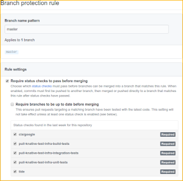

# Prow setup for Knative projects

All Prow config files for running Prow jobs for Knative projects are under
[config/prow](../config/prow).

## Setting up Prow for a new organization

1. In GitHub, add the following
   [webhooks](https://developer.github.com/webhooks/) to the org (or repo), in
   `application/json` format and for all events. Ask one of the owners of
   _knative/test-infra_ for the webhook secrets.

   1. `http://prow.knative.dev/hook` (for Prow)
   1. `https://github-dot-knative-tests.appspot.com/webhook` (for Gubernator PR
      Dashboard)

1. Create a team called _Knative Prow Robots_, and make it an Admin of the org
   (or repo).

1. Invite at least [knative-prow-robot](https://github.com/knative-prow-robot)
   for your org. Add it to the robots team you created. For automated releases
   and metrics reporting (e.g., code coverage) you'll need to also add
   [knative-prow-releaser-robot](https://github.com/knative-prow-releaser-robot)
   and [knative-metrics-robot](https://github.com/knative-metrics-robot).

## Setting up Prow for a new repo (reviewers assignment and auto merge)

1. Create the appropriate `OWNERS` and/or `OWNERS_ALIASES` files (at least for
   the root dir).

1. Make sure that _Knative Prow Robots_ team is an Admin of the repo.

1. Add the new repo to
   [config_knative.yaml](../config/prow/config_knative.yaml), the meta config
   file for generating Prow config and Prow job config. Check the top-level
   section `presubmits:` and `periodics:` for blueprints for what to add. Then
   run `./hack/generate-configs.sh` to regenerate
   [config.yaml](../config/prow/jobs/config.yaml), otherwise the presubmit test
   in test-infra will fail. Create a PR with the changes. Once it's merged the
   configs will be automatically updated by a postsubmit job.

1. Wait a few minutes, check that Prow is working by entering `/woof` as a
   comment in any PR in the new repo.

1. Set **tide** as a required status check for the master branch.

   

### Setting up jobs for a repo

1. Have the test infrastructure in place (usually this means having at least
   `//test/presubmit-tests.sh` working, and optionally `//hack/release.sh`
   working for automated nightly releases).

1. Update [config_knative.yaml](../config/prow/config_knative.yaml) (usually,
   copy and update the existing configuration from another repository). Run
   `./hack/generate-configs.sh` to regenerate
   [config/prow/jobs/config.yaml](../config/prow/jobs/config.yaml), otherwise
   the presubmit test will fail. Create a pull request with the changes. Once
   it's merged the configs will be automatically updated by a postsubmit job.

1. Wait a few minutes, enter `/test [prow_job_name]` or `/test all` or `/retest`
   as a comment in any PR in the repo and ensure the test jobs are executed.

1. Optionally, set the new test jobs as required status checks for the master
   branch.

   

## Setting up the issue tracker for a repo (optional)

If you want Prow to manage the freshness level for Issues and Pull Requests for
a repo (see the
[proposal](https://docs.google.com/document/d/15sqqVxOGAXLNEDFp777NWIpevwrSMYbGQABFLNqiq5Q/edit#heading=h.n8a530nnrb)),
you can set it up by following steps below:

1. Create the labels `lifecycle/stale`, `lifecycle/rotten` and
   `lifecycle/frozen` in the repo.

1. Update
   [`generateIssueTrackerPeriodicJobs()`](https://github.com/knative/test-infra/blob/51c37921d4a7722855fcbb020db3c3865db1cb8f/ci/prow/issue_tracker_config.go#L48)
   in
   [issue_tracker_config.go](../tools/config-generator/issue_tracker_config.go),
   adding the call to generate the config for the new repo.

1. Run `make jobs/config.yaml` to regenerate the Prow config, and submit a PR
   with the two changes. Once the PR is merged, ask the
   [oncall](https://knative.github.io/test-infra/) to update the Prow cluster.
