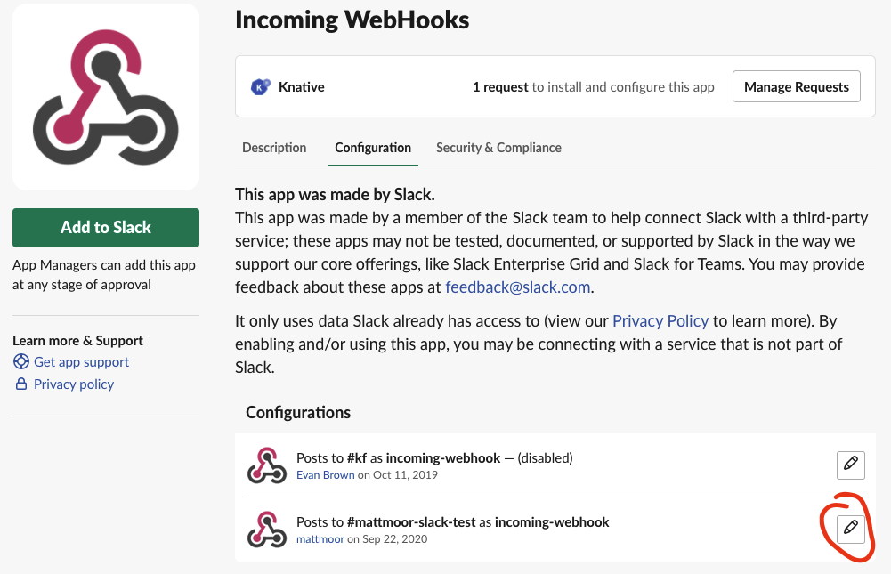

# Slack integrations

Since Knative uses slack for a lot of communications, there are also bots which communicate through Slack. From time to time, it may be necessary to rotate the credentials for these robots.

## GitHub Actions automation

GitHub Actions get access to Slack via the `SLACK_WEBHOOK` secret inherited across the `knative` and `knative-sandbox` orgs. (Both orgs use the same value for the secret, but each has their own secret.) You may need to find someone on TOC or Steering to help out with configuring the org-level secrets.

On the Slack side, the SLACK_WEBHOOK comes from the "Incoming WebHooks" integration, which provides an API endpoint ("incoming" from the point of view of Slack) which can be used to post events to different channels. The API endpoint itself acts as a secret token to authorize the usage, and the poster is flagged as an app but can otherwise change the message appearance (rich text, etc) as well as the posting name and channel through the POST metadata.

To get or reset the webhook URL, you may need a workspace owner to manage the configuration:

Click on the "configure" icon associated with the active configuration (there is one as of 17 May 2021).

Once you're in the Configuration page, there is a "Regenerate" option on the "Webhook URL" which will allow you to rotate the existing credentials by creating a new secret:

Once you have the new URL (copied from the page after selecting "regenerate"), you'll need to update the `SLACK_WEBHOOK` secret in both the [`knative`](https://github.com/organizations/knative/settings/secrets/actions) and [`knative-sandbox`](https://github.com/organizations/knative-sandbox/settings/secrets/actions) organizations. Note that as soon as you select "regenerate" in Slack, the old webhook will stop working, so the entire operation should be completed within a half hour or so if possible.
