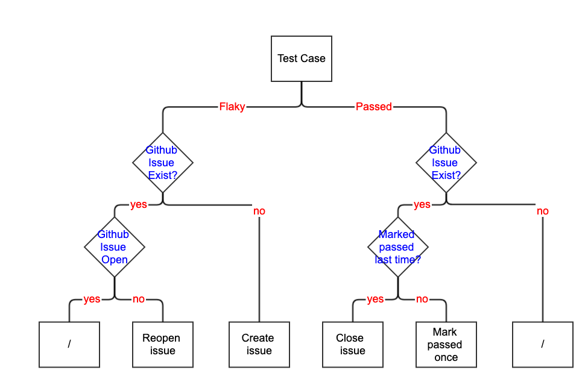

# flaky-test-reporter

flaky-test-reporter is a tool that identifies flaky tests by retrospectively analyzing continuous flows, tracks flaky tests with Github issues, and sends summary of flaky tests to Slack channels.

## Basic Usage

Flags for this tool are:

* `--service-account` specifies the path of file containing service account for GCS access.
* `--github-account` specifies the path of file containing Github token for Github API calls.
* `--slack-account` specifies the path of file containing Slack token for Slack web API calls.
* `--dry-run` enables dry-run mode.

**IMPORTANT: This tool is _NOT_ intended to run locally, as this could interfere with real Github issues and potentially flood Knative Slack channels**

For debugging purpose it's highly recommended to start with `--dry-run` flag, by passing this flag it will only collect information from GCS/Github/Slack, and all the manipulations of Github/Slack resources are omitted.

## Prow Job

There is a prow job that triggers this tool at 4:00/5:00AM(Day light saving) everyday.

## Considerations

### Criterias for a test to be considered flaky/passed?
This tool scans latest 10 runs. A test is considered flaky if it failed in some but not all runs. For a test to be considered pass, there needs be enough data, which means at least 8 valid runs(either pass or failed), and it passed in all of them.

### Logics for Github issue to be created/closed/reopened?
See diagram below

### Github Issue deduplication
Efficient deduplication is crucial for the sustainability of this tool, and this can be achieved by associate issue with test by unique identifiers. There are 2 identifiers associated with each flaky issue:

- `auto:flaky` label. This tool adds this label when creating issues, and only manages issues with this label
- `[DONT_MODIFY_TEST_IDENTIFIER]...[DONT_MODIFY_TEST_IDENTIFIER]` section in issue body. Issue with `auto:flaky` label but not this identifier is considered abnormal and this tool will stop at information collection phase.

The `[DONT_MODIFY_TEST_IDENTIFIER]...[DONT_MODIFY_TEST_IDENTIFIER]` section doesn't look good, for a test named `some/test/that/flaky/very/often`, the identifier in issue body is:

`[DONT_MODIFY_TEST_IDENTIFIER]some/test/that/flaky/very/often[DONT_MODIFY_TEST_IDENTIFIER]`

Alternatives have been considered, like hiding them in html tag like [DONT_MODIFY_TEST_IDENTIFIER]([DONT_MODIFY_TEST_IDENTIFIER]some/test/that/flaky/very/often[DONT_MODIFY_TEST_IDENTIFIER]), but decided not to do so for mainly 2 reasons:

- The html link points to 404
- It's not obvious if this identifier was accidentally edited

### Minimize Noise
#### Too many flaky tests identified
When there are too many tests found to be flaky, most likely something abnormal is going on, and we don't want to create Github issues for all of them, or list all of them in Slack notifications. There is a threshold defined in [`config.go`](config.go), if the flaky rate went over the threshold there will be only 1 Github issue created, and Slack notification will not list all flaky tests.

#### Github issue updates
This tool runs everyday, and leaves comments on existing issues everyday, to avoid flooding the issue with comments, all histories are written into the first comment by prepending it in a collapsible format, like example below:

`PLACEHOLDER for contents of latest results`

	
Click to see older results

PLACE HOLDER for old history

